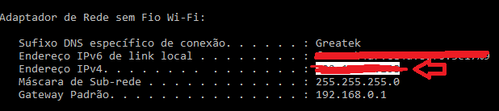

# Post App (Clean Architecture) - React Native
[](#) 
[](#)

<!-- ## 📸 Preview 

<div align="center">
  <div style="display: flex; justify-content: center;">
    
  </div>
</div> -->

## 📝 Descrição

Projeto de interface gráfica para uma rede social usando Expo com Tab Navigation personalizado e Clean Architecture.

## 🚀 Objetivo

Projeto para prática e aprendizado das libs do Expo mais recentes (2023 e 2024), customização do Layout padrão da Tab Bar do Expo Router e principalmente explorar padrões de projeto com Clean Architecture (Arquitetura limpa) no React Native / EXPO.

## 📚 Principais Libs Utilizadas

- [Expo Router](https://docs.expo.dev/router/introduction/)
- [Expo Linear Gradient](https://docs.expo.dev/versions/latest/sdk/linear-gradient/)
- [json-server](https://www.npmjs.com/package/json-server)

## 🔎 Instruções para rodar o projeto

📌 **Pré requisitos:**
1. Tenha o repositório clonado em sua máquina.
2. Tenha o [NodeJS](https://nodejs.org/) instalado em sua máquina.
3. É importante configurar o seu próprio `.env` e `.env.local` baseando-se no `.env.exemple` presente no projeto (Caso tenha).


🌐 **Como executar a API:**

Antes de executar o app, é importante configurar o [json-server](https://www.npmjs.com/package/json-server) do projeto para rodar na sua máquina. Isso será necessário já que endereço de localhost não é compatível entre o emulador e a máquina que está executando.


1. Para descobrir um **ip** válido na sua máquina, no windows, execute o comando:
```
$ ipconfig
```
1. O Windows irá exibir uma lista de ip's válidos na sua máquina. Você deve copiar o Endereço ``IPv4``. 

<div align="center">
  
</div>


2. Crie o arquivo config.json na pasta server: 
``./server/config.json``. ([Link](https://github.com/duduCMT/React-Native-Marvel/blob/master/server))

3. No arquivo, coloque o seguinte conteúdo:
```json
{
  "host": "",
  "port": 3333,
  "routes": "./server/routes.json"
}
``` 

4. No valor de `host` do json coloque o ip copiado anteriormente e salve o arquivo.
   
5. Por fim, devemos informar ao App o novo endereço do servidor.
   
6. Crie o arquivo ``.env`` na raís do projeto e adicione a variável `EXPO_PUBLIC_API_URL` conforme o .env.exemple.

7. Para executar o servidor da API use o comando ``npm run server``.


🚩 **Como executar o App:**
1. Com o terminal aberto no diretório do projeto, execute o comando `npm i --force` para instalar as dependências.
2. Após a instalação, você deve rodar o projeto localmente usando o comando `npm start` e escolher as opções para execução a depender do ambiente. (Esse projeto também é compatível com o Expo Go.)
3. Caso queira executar o expo e limpar o cache, use `expo start -c` para executar e limpar o cache.

## 🗑️ Limpar Chache do EXPO - Windows
Em algumas situações, vai ser necessário limpar o cache do EXPO, para isso, execute os seguintes passos ou confira a [documentação oficial](https://docs.expo.dev/troubleshooting/clear-cache-windows/):

```bash
rm -rf node_modules // Ou apague a pasta manualmente

npm cache clean --force

npm install

watchman watch-del-all

del %localappdata%Temphaste-map-*

del %localappdata%Tempmetro-cache

npx expo start --clear
```
<!-- 
## 📸 Preview das Telas

<div align="center">
  <div style="display: flex; justify-content: center; flex-wrap: wrap; gap: 8px;">
    
    
  </div>
</div> -->
